# Spring AI Alibaba DataAgent

（ “DataAgent用户1群”群的钉钉群号： 154405001431）

## 项目简介

这是一个基于Spring AI Alibaba Graph的企业级智能数据分析 Agent。它不仅是 Text-to-SQL 转换器，更是一个具备支持 Python 深度分析与报告生成的 AI 虚拟数据分析师。（readme不是最新的，以最新代码为主）

系统采用高度可扩展的架构设计，**全面兼容 OpenAI 接口规范**的对话模型与 Embedding 模型，并支持**灵活挂载任意向量数据库**。无论是私有化部署还是接入主流大模型服务，都能轻松适配，为企业提供灵活、可控的数据洞察服务。

同时，本项目可以支持**发布成MCP服务器**，具体看 本文档mcp章节。

## 架构与核心能力

### 1. 总体架构图

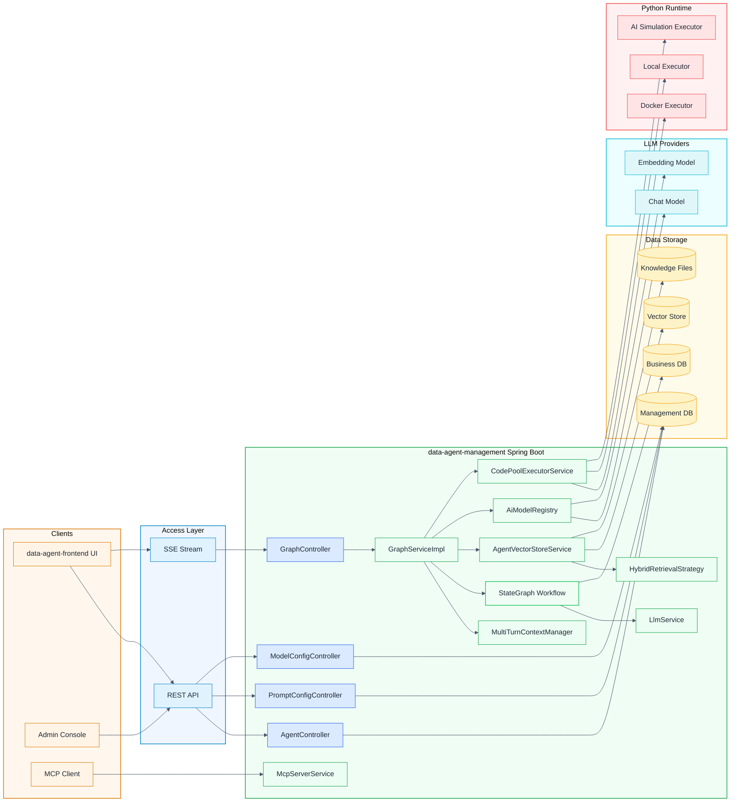

### 2. 运行时主流程

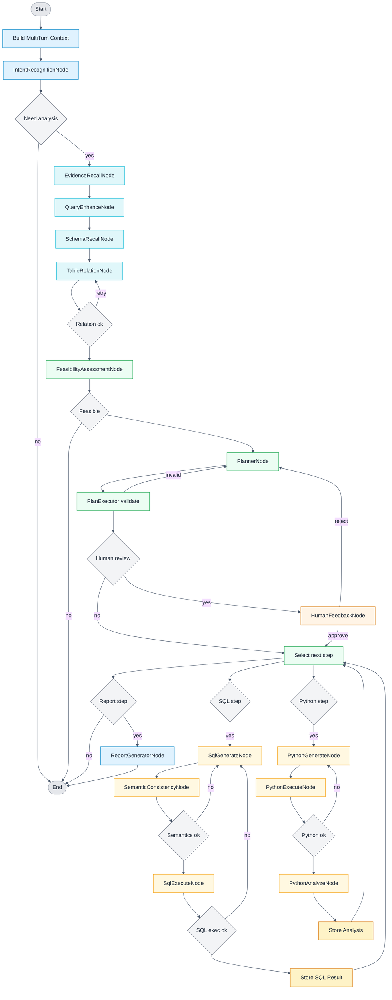

### 3. 关键能力说明（含架构图与流程图）

#### 3.1 人类反馈机制

说明要点：
- 入口：运行时请求参数 `humanFeedback=true`（`GraphController` → `GraphServiceImpl`）。
- 数据字段：`agent.human_review_enabled` 用于保存配置，运行时以请求参数为准。
- 图编排：`PlanExecutorNode` 检测 `HUMAN_REVIEW_ENABLED`，转入 `HumanFeedbackNode`。
- 暂停与恢复：`CompiledGraph` 使用 `interruptBefore(HUMAN_FEEDBACK_NODE)`，无反馈时进入“等待”，反馈到达后通过 `threadId` 继续执行。
- 反馈结果：同意继续执行；拒绝则回到 `PlannerNode` 并触发重新规划。

架构图：
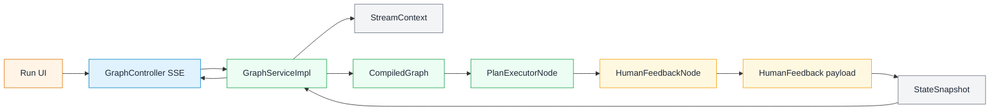

流程图：
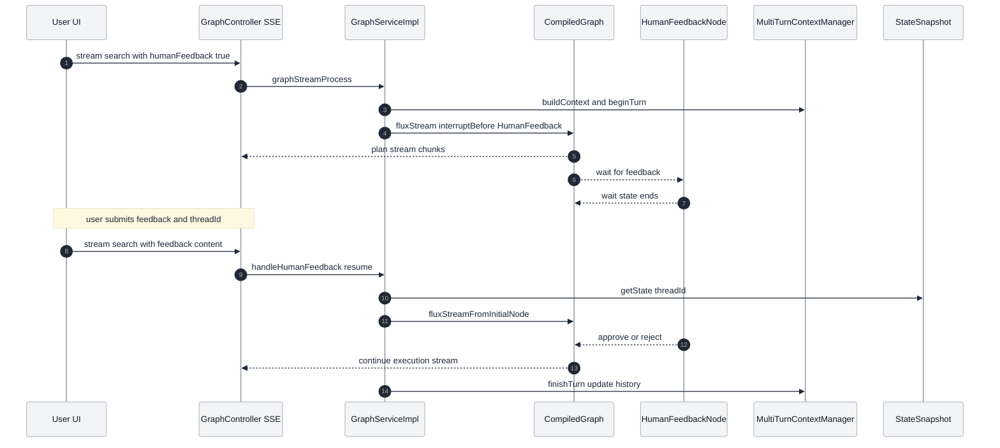

#### 3.2 Prompt 配置与自动优化

说明要点：
- 配置入口：`/api/prompt-config/*`，数据表 `user_prompt_config`。
- 作用范围：支持按 `agentId` 绑定或全局配置（`agentId` 为空）。
- Prompt 类型：`report-generator`、`planner`、`sql-generator`、`python-generator`、`rewrite`。
- 自动优化方式：`ReportGeneratorNode` 拉取启用配置（按 `priority` 与 `display_order` 排序），通过 `PromptHelper.buildReportGeneratorPromptWithOptimization` 拼接“优化要求”。
- 当前实现重点：报告生成节点已落地优化；其他类型为预留能力。

架构图：
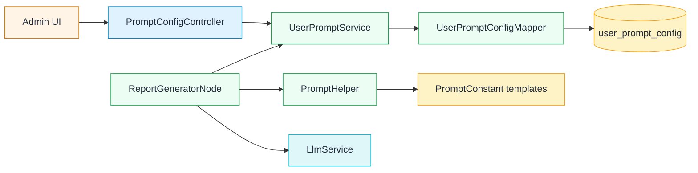

流程图：
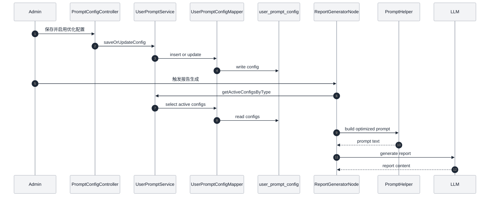

#### 3.3 RAG 检索增强

说明要点：
- 查询重写：`EvidenceRecallNode` 调用 LLM 生成独立检索问题。
- 召回通道：`AgentVectorStoreService` 执行向量检索；可选混合检索（向量+关键词，`AbstractHybridRetrievalStrategy`）。
- 文档类型：业务知识 + 智能体知识，按元数据过滤并合并为 evidence 注入后续 prompt。
- 关键配置：`spring.ai.alibaba.data-agent.vector-store.enable-hybrid-search` 及相似度/TopK 等参数。

架构图：
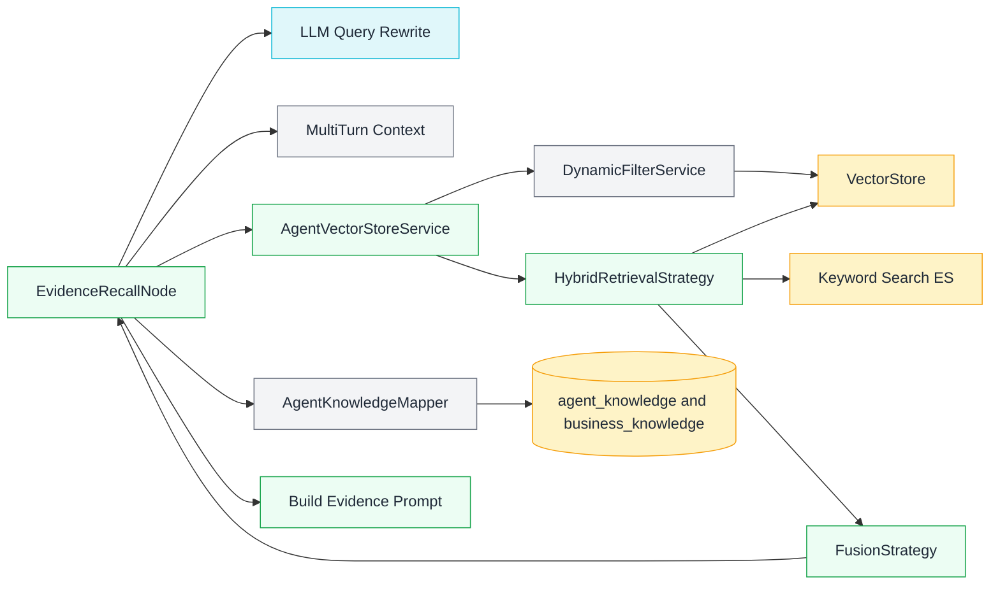

流程图：
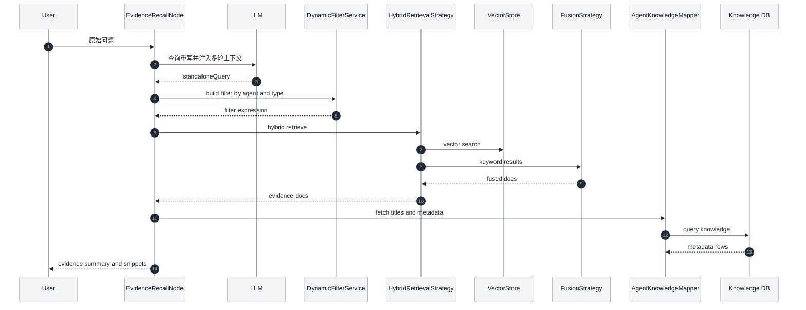

#### 3.4 报告生成与摘要生成

说明要点：
- 报告节点：`ReportGeneratorNode` 读取计划、SQL/Python 结果与摘要建议（`summary_and_recommendations`）。
- 输出格式：默认 HTML，`plainReport=true` 输出 Markdown（简洁报告）。
- 优化提示词：自动拼接优化配置后生成报告。

架构图：
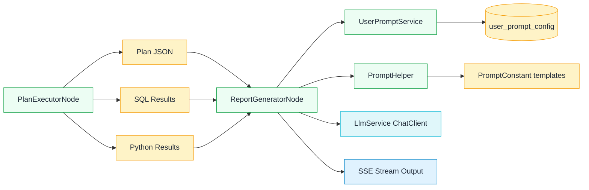

流程图：
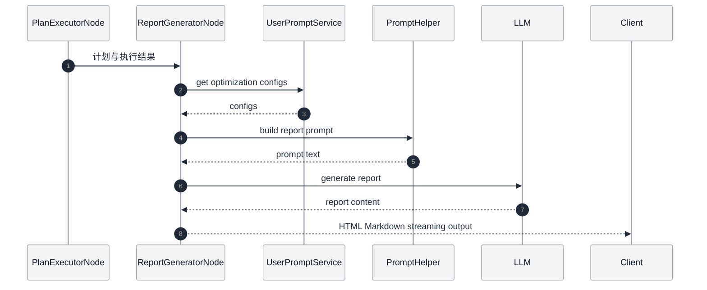

#### 3.5 流式输出与多轮对话

说明要点：
- 流式输出：`GraphController` SSE + `GraphServiceImpl` 流式处理。
- 文本标记：`TextType` 在流中标记 SQL/JSON/HTML/Markdown，前端据此渲染。
- 多轮对话：`MultiTurnContextManager` 记录“用户问题+规划结果”，注入到后续请求。
- 模式切换：`spring.ai.alibaba.data-agent.llm-service-type` 支持 `STREAM/BLOCK`。

架构图：
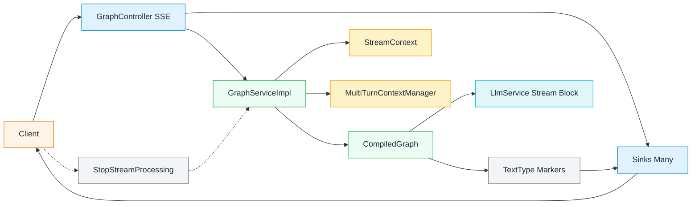

流程图：
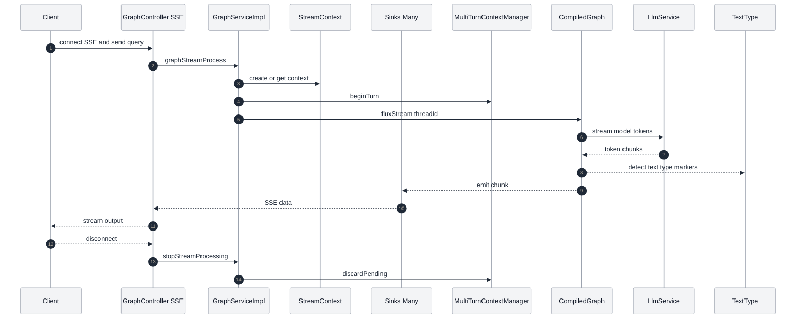

#### 3.6 MCP 与多模型调度

说明要点：
- MCP：`McpServerService` 提供 NL2SQL 与 Agent 列表工具，使用 Mcp Server Boot Starter。
- 多模型调度：`ModelConfig*` 配置模型，`AiModelRegistry` 缓存当前 Chat/Embedding 模型并支持热切换（同一时间每类仅一个激活模型）。
- 已内置工具：`nl2SqlToolCallback`、`listAgentsToolCallback`。

架构图：
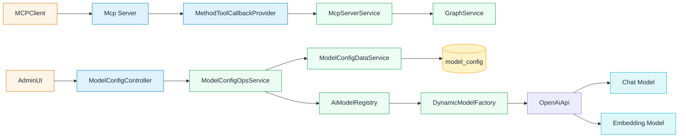

流程图：
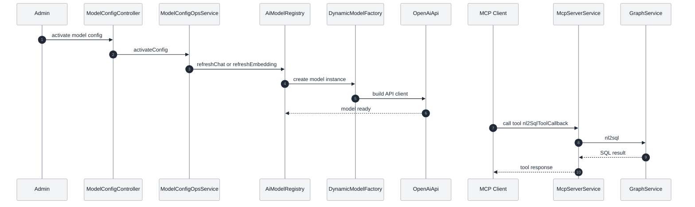

#### 3.7 API Key 管理

说明要点：
- 管理端：`AgentController` 支持生成、重置、删除与启用/禁用 API Key。
- 数据字段：`agent.api_key` 与 `agent.api_key_enabled`。
- 调用方式：请求头 `X-API-Key`（需自行实现后端校验逻辑）。
- 注意：默认后端未对 `X-API-Key` 做鉴权拦截，生产需自行补充。

架构图：
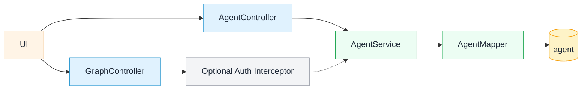

流程图：
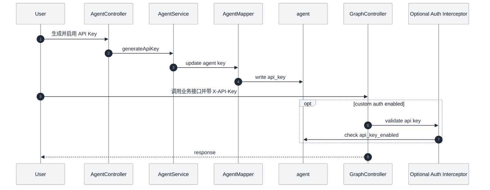

#### 3.8 Python 执行与结果回传

说明要点：
- 代码生成：`PythonGenerateNode` 根据计划与 SQL 结果生成 Python。
- 代码执行：`PythonExecuteNode` 使用 `CodePoolExecutorService`（Docker/Local/AI 模拟）。
- 执行配置：`spring.ai.alibaba.data-agent.code-executor.*`（默认 Docker 镜像 `continuumio/anaconda3:latest`）。
- 结果回传：执行结果写回 `PYTHON_EXECUTE_NODE_OUTPUT`，`PythonAnalyzeNode` 汇总后写入 `SQL_EXECUTE_NODE_OUTPUT`，用于最终报告。

架构图：
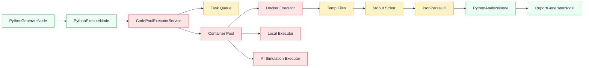

流程图：
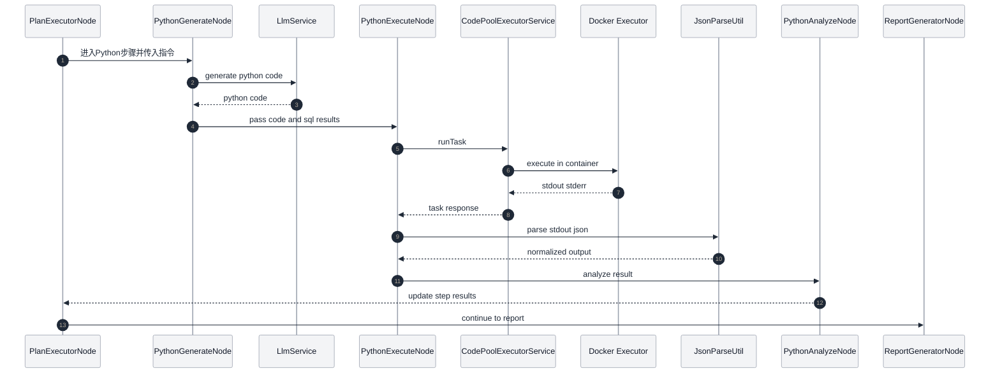

## 项目结构

这个项目分为两个部分：

```
spring-ai-alibaba-data-agent/
├── data-agent-management    # 管理端（可直接启动的Web应用）
└── data-agent-frontend>     # 前端代码 
```

## 快速启动

项目进行本地测试是在data-agent-management中进行

### 1. 业务数据库准备

可以在项目仓库获取测试表和数据：

文件在：`data-agent-management/src/main/resources/sql`，里面有4个文件：`schema.sql` 和 `data.sql`和`product_shcema.sql`和`product_data.sql`，具体的模拟数据表结构和数据可以参考这两个文件，`product_shcema.sql`和`product_data.sql`，跟功能相关的表结构和数据可以参考`schema.sql`和`data.sql`。

将表和数据导入到你的MySQL数据库中。

### 2. 配置

#### 2.1 配置management数据库

在`data-agent-management/src/main/resources/application.yml`中配置你的MySQL数据库连接信息。

> 初始化行为说明：默认开启自动创建表并插入示例数据（`spring.sql.init.mode: always`）。生产环境建议关闭，避免示例数据回填覆盖你的业务数据。

```yaml
spring:
  datasource:
    url: jdbc:mysql://127.0.0.1:3306/saa_data_agent?useUnicode=true&characterEncoding=utf-8&zeroDateTimeBehavior=convertToNull&transformedBitIsBoolean=true&allowMultiQueries=true&allowPublicKeyRetrieval=true&useSSL=false&serverTimezone=Asia/Shanghai
    username: ${MYSQL_USERNAME:root}
    password: ${MYSQL_PASSWORD:root}
    driver-class-name: com.mysql.cj.jdbc.Driver
    type: com.alibaba.druid.pool.DruidDataSource
```

#### 2.2 可选：启用/关闭自动初始化（schema.sql + data.sql）

- 默认配置：`application.yml` 中已设置为开启

```yaml
spring:
  sql:
    init:
      mode: always           # 默认：每次启动执行 schema.sql 与 data.sql
      schema-locations: classpath:sql/schema.sql
      data-locations: classpath:sql/data.sql
```

- 若不希望每次启动回填示例数据，可将 `mode` 改为 `never` 关闭：

```yaml
spring:
  sql:
    init:
      mode: never            # 关闭自动初始化
      schema-locations: classpath:sql/schema.sql
      data-locations: classpath:sql/data.sql
```

注意：默认开启时（`mode: always`），`data.sql` 会在每次启动回填示例数据（即使你手动删除了数据）。生产环境请改为 `mode: never`，避免覆盖/复原业务数据。

#### 2.3 配置模型

**注意，如果你之前是自己用starter引入的聊天模型和嵌入模型的pom依赖，需要自己去掉，也不能自己手动初始化ChatClient和ChatModel以及EmbeddingModel了。**

启动项目，点击模型配置，新增模型填写自己的apikey即可。


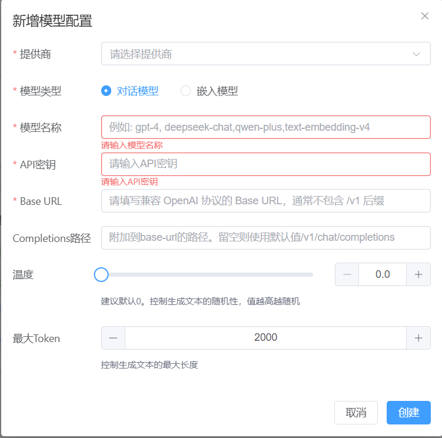

注意，如Qwen，OpenAi,Deepseek,Siliconflow(硅基流动) 等兼容Open Ai的厂商不需要更改Completions 路径和Embedding路径。

如果是自己部署的模型，baseurl和completions-path就是完整的chat模型地址，向量模型同理。

#### 2.4 嵌入模型批处理策略配置

| 属性                                                        | 说明                                                         | 默认值      |
| ----------------------------------------------------------- | ------------------------------------------------------------ | ----------- |
| spring.ai.alibaba.data-agent.embedding-batch.encoding-type      | 文本编码类型，可参考com.knuddels.jtokkit.api.EncodingType    | cl100k_base |
| spring.ai.alibaba.data-agent.embedding-batch.max-token-count    | 每批次最大令牌数 值越小，每批次文档越少，但更安全 值越大，处理效率越高，但可能超出API限制 建议值：2000-8000，根据实际API限制调整 | 2000        |
| spring.ai.alibaba.data-agent.embedding-batch.reserve-percentage | 预留百分比 用于预留缓冲空间，避免超出限制 建议值：0.1-0.2（10%-20%） | 0.2         |
| spring.ai.alibaba.data-agent.embedding-batch.max-text-count     | 每批次最大文本数量 适用于DashScope等有文本数量限制的API DashScope限制为10 | 10          |

#### 2.5 向量库配置

系统默认使用内存向量库，同时系统提供了对es的混合检索支持。

##### 2.5.1 向量库依赖引入

您可以自行引入你想要的持久化向量库，只需要往ioc容器提供一个org.springframework.ai.vectorstore.VectorStore类型的bean即可。例如直接引入PGvector的starter

```java
<dependency>
	<groupId>org.springframework.ai</groupId>
	<artifactId>spring-ai-starter-vector-store-pgvector</artifactId>
</dependency>
```

详细对应的向量库参考文档https://springdoc.cn/spring-ai/api/vectordbs.html

##### 2.5.2 向量库schema设置

以下为es的schema结构，其他向量库如milvus，pg等自行可根据如下的es的结构建立自己的schema.尤其要注意metadata中的每个字段的数据类型。

```json
{
  "mappings": {
    "properties": {
      "content": {
        "type": "text",
        "fields": {
          "keyword": {
            "type": "keyword",
            "ignore_above": 256
          }
        }
      },
      "embedding": {
        "type": "dense_vector",
        "dims": 1024,
        "index": true,
        "similarity": "cosine",
        "index_options": {
          "type": "int8_hnsw",
          "m": 16,
          "ef_construction": 100
        }
      },
      "id": {
        "type": "text",
        "fields": {
          "keyword": {
            "type": "keyword",
            "ignore_above": 256
          }
        }
      },
      "metadata": {
        "properties": {
          "agentId": {
            "type": "text",
            "fields": {
              "keyword": {
                "type": "keyword",
                "ignore_above": 256
              }
            }
          },
          "agentKnowledgeId": {
            "type": "long"
          },
          "businessTermId": {
            "type": "long"
          },
          "concreteAgentKnowledgeType": {
            "type": "text",
            "fields": {
              "keyword": {
                "type": "keyword",
                "ignore_above": 256
              }
            }
          },
          "vectorType": {
            "type": "text",
            "fields": {
              "keyword": {
                "type": "keyword",
                "ignore_above": 256
              }
            }
          }
        }
      }
    }
  }
}
```


| 属性                                                         | 说明                                                         | 默认值    |
| ------------------------------------------------------------ | ------------------------------------------------------------ | --------- |
| spring.ai.alibaba.data-agent.vector-store.similarity-threshold | 相似度阈值配置，用于过滤相似度分数大于等于此阈值的文档       | 0.2       |
| spring.ai.alibaba.data-agent.vector-store.batch-del-topk-limit | 一次删除操作中，最多删除的文档数量                           | 5000      |
| spring.ai.alibaba.data-agent.vector-store.topk-limit           | 查询返回最大文档数                                           | 30        |
| spring.ai.alibaba.data-agent.vector-store.enable-hybrid-search | 是否启用混合搜索。**注意**：**项目目前默认只提供ES的混合检索能力，<br />如需要扩展其他向量库可自行继承重写 com.alibaba.cloud.ai.dataagent.service.hybrid.retrieval<br />.AbstractHybridRetrievalStrategy#retrieve 该方法**<br />**并且修改com.alibaba.cloud.ai.service.hybrid.<br />factory.HybridRetrievalStrategyFactory#getObject<br />注册相应的bean** | **false** |
| spring.ai.alibaba.data-agent.vector-store.elasticsearch-min-score | Elasticsearch最小分数阈值，用于es执行关键词搜索时过滤相关性较低的文档。<br />**开发时使用的es服务端版本 8.15.0** | 0.5       |

#### 2.6 检索融合策略

| 属性                                     | 说明                 | 默认值 |
| ---------------------------------------- | -------------------- | ------ |
| spring.ai.alibaba.data-agent.fusion-strategy | 多路召回结果融合策略 | rrf    |
|                                          |                      |        |

#### 2.7 替换vector-store的实现类

本项目`VectorStore`默认使用内存向量，你可以替换成其他模型实现。

在[根pom](./pom.xml)中你可以引入其他`VectorStore`的实现starter，以替换掉项目默认使用的实现。比如你想使用`milvus`你可以这样：

```xml
    <dependencies>
        <!-- 在这里可以替换vector-storestarter -->
        <!-- 如果不使用默认依赖的话，需要手动配置application.yml -->

        <!--            milvus  -->
        <dependency>
            <groupId>org.springframework.ai</groupId>
            <artifactId>spring-ai-starter-vector-store-milvus</artifactId>
        </dependency>
    </dependencies>
```

注意在`application.yml`中配置相应设置，以符合这些starter的需求。

### 3. 启动管理端

在`data-agent-management`目录下，运行 `DataAgentApplication.java` 类。

### 4. 启动WEB页面

进入 `data-agent-frontend` 目录

#### 4.1 安装依赖

```bash
# 使用 npm
npm install

# 或使用 yarn
yarn install
```

#### 4.2 启动服务

```bash
# 使用 npm
npm run dev

# 或使用 yarn
yarn dev
```

启动成功后，访问地址 http://localhost:3000

## 系统体验

### 数据智能体的创建与配置

访问 http://localhost:3000 ，可以看到当前项目的智能体列表（默认有四个占位智能体，并没有对接数据，可以删除掉然后创建新的智能体）

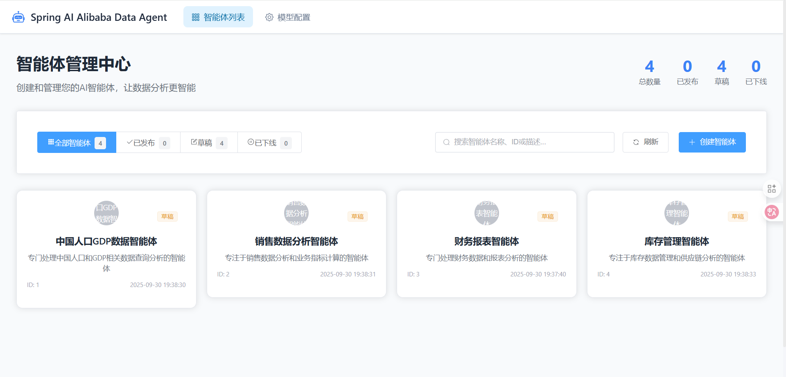

点击右上角“创建智能体” ，这里只需要输入智能体名称，其他配置都选默认。


创建成功后，可以看到智能体配置页面。


进入数据源配置页面，配置业务数据库（我们在环境初始化时第一步提供的业务数据库）。


添加完成后，可以在列表页面验证数据源连接是否正常。


对于添加的新数据源，需要选择使用哪些数据表进行数据分析。


之后点击右上角的“初始化数据源”按钮。


预设问题管理，可以为智能体设置预设问题


语义模型管理，可以为智能体设置语义模型。
语义模型库定义业务术语到数据库物理结构的精确转换规则，存储的是字段名的映射关系。
例如`customerSatisfactionScore`对应数据库中的`csat_score`字段。


业务知识管理，可以为智能体设置业务知识。
业务知识定义了业务术语和业务规则，比如GMV= 商品交易总额,包含付款和未付款的订单金额。
业务知识可以设置为召回或者不召回，配置完成后需要点击右上角的“同步到向量库”按钮。


成功后可以点击“前往运行界面”使用智能体进行数据查询。 调试没问题后，可以发布智能体。

> 目前“智能体知识”和“访问API”当前版本暂未实现。

### 数据智能体的运行

运行界面


运行界面左侧是历史消息记录，右侧是当前会话记录、输入框以及请求参数配置。

输入框中输入问题，点击“发送”按钮，即可开始查询。


分析报告为HTML格式报告，点击“下载报告”按钮，即可下载最终报告。


除了默认的请求模式，智能体运行时还支持“人工反馈”，“仅NL2SQL”，“简洁报告”和“显示SQL运行结果”等模式。

默认情况不开启人工反馈模式，智能体直接自动生成计划并执行，并对SQL执行结果进行解析，生成报告。
如果开启人工反馈模式，则智能体会在生成计划后，等待用户确认，然后根据用户选择的反馈结果，更改计划或者执行计划。


“仅NL2SQL模式”会让智能体只生成SQL和运行获取结果，不会生成报告。


“显示SQL运行结果”会在生成SQL和运行获取结果后，将SQL运行结果展示给用户。


### 访问 API（API Key 调用）

> 当前版本仅提供 API Key 生成、重置、删除与开关的管理能力，**尚未在后端对 `X-API-Key` 做权限校验**；需要鉴权的生产场景请自行在后端拦截器中补充校验逻辑后再对外开放。

1. 在智能体详情左侧菜单进入“访问 API”，为智能体生成 Key，并根据需要启用/禁用。
2. 调用会话接口时在请求头添加 `X-API-Key: <your_api_key>`。
3. 示例（本地默认前端代理端口 3000）：

```bash
# 创建会话
curl -X POST "http://127.0.0.1:3000/api/agent/<agentId>/sessions" \
  -H "Content-Type: application/json" \
  -H "X-API-Key: <your_api_key>" \
  -d '{"title":"demo"}'

# 发送消息
curl -X POST "http://127.0.0.1:3000/api/sessions/<sessionId>/messages" \
  -H "Content-Type: application/json" \
  -H "X-API-Key: <your_api_key>" \
  -d '{"role":"user","content":"给我一个示例","messageType":"text"}'
```

界面预览：

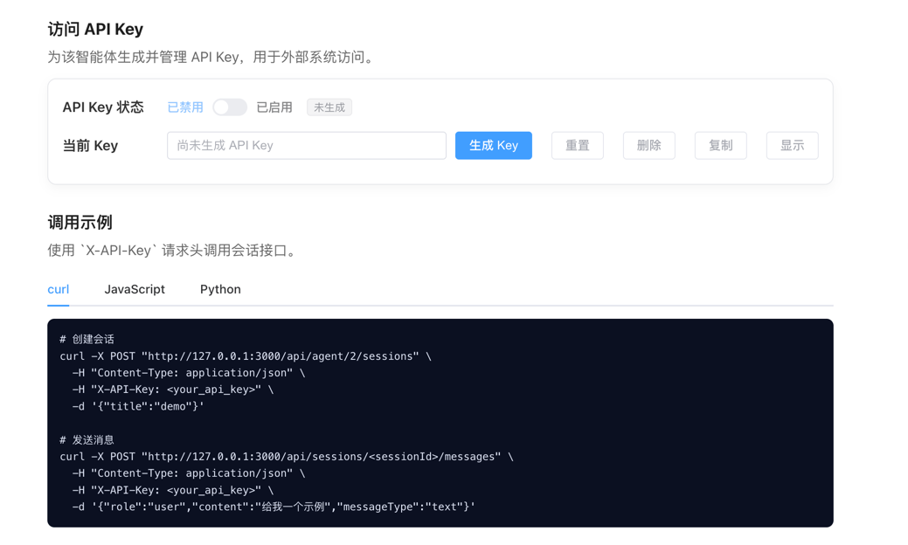


## MCP服务器

1、本项目是通过Mcp server Boot Starter实现mcp服务器的，因此更多详细配置可以参考文档

https://springdoc.cn/spring-ai/api/mcp/mcp-server-boot-starter-docs.html#_%E9%85%8D%E7%BD%AE%E5%B1%9E%E6%80%A7

默认mcp  Web 传输的自定义 SSE 端点路径： 项目地址:项目端口/sse 。例如 http://localhost:8065/sse

你也可通过`spring.ai.mcp.server.sse-endpoint` 修改为其他路径，具体看上面提到的mcp参考文档。

2、目前提供的mcp工具如下

```json
{
  "tools": [
    {
      "name": "nl2SqlToolCallback",
      "description": "将自然语言查询转换为SQL语句。使用指定的智能体将用户的自然语言查询描述转换为可执行的SQL语句，支持复杂的数据查询需求。",
      "inputSchema": {
        "type": "object",
        "properties": {
          "nl2SqlRequest": {
            "type": "object",
            "properties": {
              "agentId": {
                "type": "string",
                "description": "智能体ID，用于指定使用哪个智能体进行NL2SQL转换"
              },
              "naturalQuery": {
                "type": "string",
                "description": "自然语言查询描述，例如：'查询销售额最高的10个产品'"
              }
            },
            "required": [
              "agentId",
              "naturalQuery"
            ]
          }
        },
        "required": [
          "nl2SqlRequest"
        ],
        "additionalProperties": false
      }
    },
    {
      "name": "listAgentsToolCallback",
      "description": "查询智能体列表，支持按状态和关键词过滤。可以根据智能体的状态（如已发布PUBLISHED、草稿DRAFT等）进行过滤，也可以通过关键词搜索智能体的名称、描述或标签。返回按创建时间降序排列的智能体列表。",
      "inputSchema": {
        "type": "object",
        "properties": {
          "agentListRequest": {
            "type": "object",
            "properties": {
              "keyword": {
                "type": "string",
                "description": "按关键词搜索智能体名称或描述"
              },
              "status": {
                "type": "string",
                "description": "按状态过滤，例如 '状态：draft-待发布，published-已发布，offline-已下线"
              }
            },
            "required": [
              "keyword",
              "status"
            ]
          }
        },
        "required": [
          "agentListRequest"
        ],
        "additionalProperties": false
      }
    }
  ]
}
```


3、如需本地自行调试mcp服务器功能可通过如下命令跳转到调试页面

```typescript
 npx @modelcontextprotocol/inspector http://localhost:8065/mcp/connection
```


## 如何贡献

我们欢迎社区的贡献！如果你想为本项目做出贡献，请查看我们的[贡献指南](./CONTRIBUTING-zh.md)。
