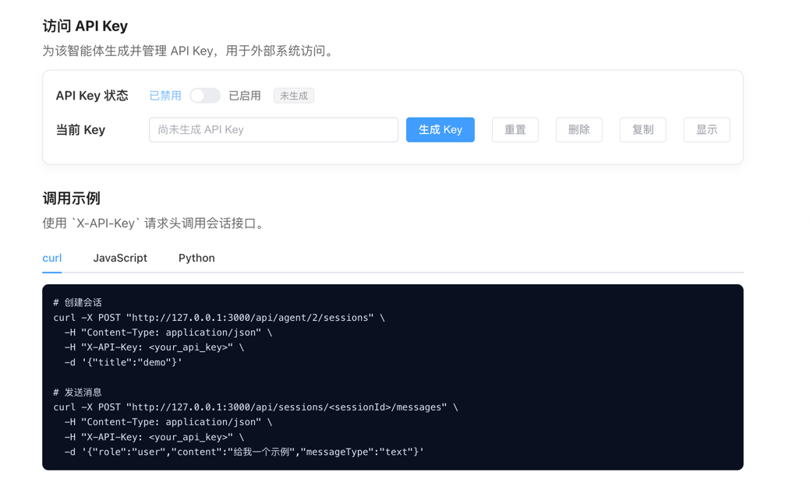

中文 | [English](./ADVANCED_FEATURES-en.md)

# 高级功能使用

本文档介绍 DataAgent 的高级功能和自定义配置选项。

## 🔑 访问 API（API Key 调用）

> **注意**: 当前版本仅提供 API Key 生成、重置、删除与开关的管理能力，**尚未在后端对 `X-API-Key` 做权限校验**；需要鉴权的生产场景请自行在后端拦截器中补充校验逻辑后再对外开放。

### API Key 管理

1. 在智能体详情左侧菜单进入"访问 API"
2. 为智能体生成 Key，并根据需要启用/禁用
3. 调用会话接口时在请求头添加 `X-API-Key: <your_api_key>`



### API 调用示例

#### 创建会话

```bash
curl -X POST "http://127.0.0.1:3000/api/agent/<agentId>/sessions" \
  -H "Content-Type: application/json" \
  -H "X-API-Key: <your_api_key>" \
  -d '{"title":"demo"}'
```

#### 发送消息

```bash
curl -X POST "http://127.0.0.1:3000/api/sessions/<sessionId>/messages" \
  -H "Content-Type: application/json" \
  -H "X-API-Key: <your_api_key>" \
  -d '{"role":"user","content":"给我一个示例","messageType":"text"}'
```

### 实现自定义鉴权

如需在生产环境启用API Key鉴权，可以创建一个拦截器：

```java
@Component
public class ApiKeyAuthInterceptor implements HandlerInterceptor {
    
    @Autowired
    private AgentService agentService;
    
    @Override
    public boolean preHandle(HttpServletRequest request, 
                            HttpServletResponse response, 
                            Object handler) throws Exception {
        String apiKey = request.getHeader("X-API-Key");
        
        if (apiKey == null || apiKey.isEmpty()) {
            response.setStatus(HttpServletResponse.SC_UNAUTHORIZED);
            return false;
        }
        
        // 验证API Key
        boolean isValid = agentService.validateApiKey(apiKey);
        
        if (!isValid) {
            response.setStatus(HttpServletResponse.SC_FORBIDDEN);
            return false;
        }
        
        return true;
    }
}
```

## 🔌 MCP服务器

DataAgent 支持作为 MCP (Model Context Protocol) 服务器对外提供服务。

### 配置说明

本项目通过 **Mcp Server Boot Starter** 实现MCP服务器功能。

更多详细配置请参考官方文档：
https://springdoc.cn/spring-ai/api/mcp/mcp-server-boot-starter-docs.html#_配置属性

### 端点配置

**默认配置**:
- MCP Web 传输的自定义 SSE 端点路径：`项目地址:项目端口/sse`
- 例如：`http://localhost:8065/sse`

**自定义端点**:

可通过配置修改端点路径：

```yaml
spring:
  ai:
    mcp:
      server:
        sse-endpoint: /custom-mcp-endpoint
```

### 可用工具

#### 1. nl2SqlToolCallback

将自然语言查询转换为SQL语句。

```json
{
  "name": "nl2SqlToolCallback",
  "description": "将自然语言查询转换为SQL语句。使用指定的智能体将用户的自然语言查询描述转换为可执行的SQL语句，支持复杂的数据查询需求。",
  "inputSchema": {
    "type": "object",
    "properties": {
      "nl2SqlRequest": {
        "type": "object",
        "properties": {
          "agentId": {
            "type": "string",
            "description": "智能体ID，用于指定使用哪个智能体进行NL2SQL转换"
          },
          "naturalQuery": {
            "type": "string",
            "description": "自然语言查询描述，例如：'查询销售额最高的10个产品'"
          }
        },
        "required": ["agentId", "naturalQuery"]
      }
    },
    "required": ["nl2SqlRequest"],
    "additionalProperties": false
  }
}
```

**使用示例**:

```json
{
  "nl2SqlRequest": {
    "agentId": "agent-123",
    "naturalQuery": "查询过去30天销售额最高的10个产品"
  }
}
```

#### 2. listAgentsToolCallback

查询智能体列表，支持按状态和关键词过滤。

```json
{
  "name": "listAgentsToolCallback",
  "description": "查询智能体列表，支持按状态和关键词过滤。可以根据智能体的状态（如已发布PUBLISHED、草稿DRAFT等）进行过滤，也可以通过关键词搜索智能体的名称、描述或标签。返回按创建时间降序排列的智能体列表。",
  "inputSchema": {
    "type": "object",
    "properties": {
      "agentListRequest": {
        "type": "object",
        "properties": {
          "keyword": {
            "type": "string",
            "description": "按关键词搜索智能体名称或描述"
          },
          "status": {
            "type": "string",
            "description": "按状态过滤，例如 '状态：draft-待发布，published-已发布，offline-已下线"
          }
        },
        "required": ["keyword", "status"]
      }
    },
    "required": ["agentListRequest"],
    "additionalProperties": false
  }
}
```

**使用示例**:

```json
{
  "agentListRequest": {
    "keyword": "销售",
    "status": "published"
  }
}
```

### 本地调试

使用 MCP Inspector 进行本地调试：

```bash
npx @modelcontextprotocol/inspector http://localhost:8065/mcp/connection
```

这将打开一个调试界面，可以测试MCP服务器的各项功能。
## 🔗 逻辑外键支持

### 功能概述

在实际生产环境中,许多数据库为了性能考虑不设置物理外键约束,这导致了以下问题:
- LLM 无法自动推断表间关系
- 多表 JOIN 查询准确率下降
- 复杂业务查询失败率高

DataAgent 创新性地实现了**逻辑外键配置功能**,允许用户手动定义表间关系,显著提升了多表查询的准确性。

### 业务场景

典型场景包括:
- 订单表和用户表通过 `user_id` 关联,但数据库未设置外键
- 商品表和分类表的关系未在数据库层面体现
- 历史遗留系统的表关系仅存在于业务逻辑中

### 数据模型

逻辑外键信息存储在 `logical_relation` 表中:

```sql
CREATE TABLE logical_relation (
  id INT PRIMARY KEY AUTO_INCREMENT,
  datasource_id INT NOT NULL,           -- 关联的数据源
  source_table_name VARCHAR(100),       -- 主表名
  source_column_name VARCHAR(100),      -- 主表字段
  target_table_name VARCHAR(100),       -- 关联表名
  target_column_name VARCHAR(100),      -- 关联表字段
  relation_type VARCHAR(20),            -- 关系类型: 1:1, 1:N, N:1
  description VARCHAR(500),             -- 业务描述
  FOREIGN KEY (datasource_id) REFERENCES datasource(id)
);
```

### 工作流程

逻辑外键的处理流程如下:

```
前端添加逻辑外键 
    ↓
Schema召回时加载逻辑外键
    ↓
过滤与召回表相关的外键
    ↓
合并物理外键和逻辑外键
    ↓
基于完整Schema生成SQL
```

### 技术实现

#### 1. 获取逻辑外键

系统在 Schema 召回阶段会自动获取相关的逻辑外键:

```java
private List<String> getLogicalForeignKeys(Integer agentId, 
        List<Document> tableDocuments) {
    
    // 1. 获取当前智能体的数据源
    AgentDatasource agentDatasource = 
        agentDatasourceService.getCurrentAgentDatasource(agentId);
    
    // 2. 提取召回的表名列表
    Set<String> recalledTableNames = tableDocuments.stream()
        .map(doc -> (String) doc.getMetadata().get("name"))
        .collect(Collectors.toSet());
    
    // 3. 查询该数据源的所有逻辑外键
    List<LogicalRelation> allLogicalRelations = 
        datasourceService.getLogicalRelations(datasourceId);
    
    // 4. 过滤只保留与召回表相关的外键
    List<String> formattedForeignKeys = allLogicalRelations.stream()
        .filter(lr -> recalledTableNames.contains(lr.getSourceTableName())
                   || recalledTableNames.contains(lr.getTargetTableName()))
        .map(lr -> String.format("%s.%s=%s.%s", 
            lr.getSourceTableName(), lr.getSourceColumnName(),
            lr.getTargetTableName(), lr.getTargetColumnName()))
        .distinct()
        .collect(Collectors.toList());
    
    return formattedForeignKeys;
}
```

**关键特性**:
- 只获取与召回表相关的逻辑外键,避免不必要的信息干扰
- 格式化为统一的外键描述格式: `table1.column1=table2.column2`
- 自动去重,避免重复定义

#### 2. 聚合外键信息

在 `TableRelationNode` 节点中,将逻辑外键合并到物理外键中:

```java
private SchemaDTO buildInitialSchema(String agentId, 
        List<Document> columnDocuments, 
        List<Document> tableDocuments,
        DbConfig agentDbConfig, 
        List<String> logicalForeignKeys) {
    
    SchemaDTO schemaDTO = new SchemaDTO();
    
    // 构建基础Schema(包含物理外键)
    schemaService.buildSchemaFromDocuments(agentId, 
        columnDocuments, tableDocuments, schemaDTO);
    
    // 将逻辑外键合并到Schema的foreignKeys字段
    if (logicalForeignKeys != null && !logicalForeignKeys.isEmpty()) {
        List<String> existingForeignKeys = schemaDTO.getForeignKeys();
        if (existingForeignKeys == null || existingForeignKeys.isEmpty()) {
            // 没有物理外键时,直接使用逻辑外键
            schemaDTO.setForeignKeys(logicalForeignKeys);
        } else {
            // 合并物理外键和逻辑外键
            List<String> allForeignKeys = new ArrayList<>(existingForeignKeys);
            allForeignKeys.addAll(logicalForeignKeys);
            schemaDTO.setForeignKeys(allForeignKeys);
        }
        log.info("Merged {} logical foreign keys into schema", 
            logicalForeignKeys.size());
    }
    
    return schemaDTO;
}
```

**设计优势**:
- 物理外键和逻辑外键统一处理,对下游透明
- 逻辑外键优先级与物理外键相同
- 完整的外键信息提升 LLM 对表关系的理解

### 使用示例

#### 配置逻辑外键

在前端数据源管理界面:

1. 选择数据源
2. 进入"逻辑外键管理"
3. 添加外键关系:
   - 源表: `orders`
   - 源字段: `user_id`
   - 目标表: `users`
   - 目标字段: `id`
   - 关系类型: `N:1`
   - 描述: "订单表关联用户表"

#### 效果对比

**未配置逻辑外键**:
```
用户问题: "查询用户张三的所有订单"
生成SQL: SELECT * FROM orders WHERE user_name = '张三'  --  错误
```

**配置逻辑外键后**:
```
用户问题: "查询用户张三的所有订单"
生成SQL:  -- ✅ 正确
SELECT o.* 
FROM orders o
JOIN users u ON o.user_id = u.id
WHERE u.name = '张三'
```

### 最佳实践

1. **优先配置高频关联**: 先配置业务中最常用的表关联关系
2. **添加描述信息**: 详细的关系描述有助于 LLM 理解业务语义
3. **定期维护**: 随着业务变化及时更新逻辑外键配置
4. **关系类型准确**: 正确标注 1:1、1:N、N:1 关系,提升推理准确性

### 注意事项

- 逻辑外键配置仅用于 Schema 增强,不会影响实际数据库结构
- 错误的逻辑外键配置可能导致生成错误的 SQL
- 建议与数据库管理员确认表关系的准确性

## 🐍 Python 执行环境配置

Python 统一通过 Spring AI Alibaba Sandbox 在任务级独立容器中执行，不再提供宿主机
Local、旧 Docker 容器池或 AI Simulation 执行器。

### SAA 沙盒配置

```yaml
spring:
  ai:
    alibaba:
      data-agent:
        code-executor:
          code-timeout: 60s
          limit-memory: 500
          cpu-core: 1
          sandbox:
            image-name: ${DATAAGENT_SANDBOX_IMAGE}
            max-concurrency: 4
            queue-capacity: 10
            package-index-url: ${DATAAGENT_PYPI_INDEX_URL:https://pypi.org/simple}
            dependency-install-timeout: 3m
```

### 动态依赖

```python
# /// script
# dependencies = ["pandas>=2,<3"]
# ///
```

依赖由固定的后端命令在当前任务沙盒内安装。模型不能指定仓库、URL、文件路径、pip 参数
或 shell 命令。生产环境应将包索引配置为企业私有 PyPI 代理。

## ⚙️ 高级配置选项

### LLM 服务类型

```yaml
spring:
  ai:
    alibaba:
      data-agent:
        llm-service-type: STREAM  # STREAM 或 BLOCK
```

- `STREAM`: 流式输出，适合实时交互
- `BLOCK`: 阻塞式输出，等待完整结果

### 多轮对话配置

```yaml
spring:
  ai:
    alibaba:
      data-agent:
        multi-turn:
          enabled: true
          max-history: 10  # 最大历史轮数
          context-window: 4096  # 上下文窗口大小
```

### 计划执行配置

```yaml
spring:
  ai:
    alibaba:
      data-agent:
        plan-executor:
          max-retry: 3  # 最大重试次数
          timeout: 600000  # 10分钟超时
```

## 📊 Langfuse 可观测性

DataAgent 集成了 [Langfuse](https://langfuse.com/) 作为 LLM 可观测性平台，通过 OpenTelemetry 协议上报追踪数据，帮助您监控和分析智能体的运行状况。

### 功能概述

- **请求追踪**: 记录每次 Graph 流式处理的完整生命周期
- **Token 用量统计**: 累计每次请求的 prompt tokens 和 completion tokens
- **错误追踪**: 记录异常类型和错误信息，便于排查问题
- 
### 配置方式

在 `application.yml` 中配置 Langfuse 连接信息：

```yaml
spring:
  ai:
    alibaba:
      data-agent:
        langfuse:
          enabled: ${LANGFUSE_ENABLED:true}
          host: ${LANGFUSE_HOST:}
          public-key: ${LANGFUSE_PUBLIC_KEY:}
          secret-key: ${LANGFUSE_SECRET_KEY:}
```

或通过环境变量配置：

```bash
export LANGFUSE_ENABLED=true
export LANGFUSE_HOST=https://cloud.langfuse.com
export LANGFUSE_PUBLIC_KEY=pk-lf-xxx
export LANGFUSE_SECRET_KEY=sk-lf-xxx
```

> 配置参数详情请参考 [开发者指南 - Langfuse 配置](DEVELOPER_GUIDE.md#11-langfuse-可观测性配置-langfuse-observability)。


### 禁用 Langfuse

如不需要可观测性功能，设置 `enabled` 为 `false` 即可，系统将使用 noop OpenTelemetry 实例，不会产生任何性能开销：

```yaml
spring:
  ai:
    alibaba:
      data-agent:
        langfuse:
          enabled: false
```

## 📚 相关文档

- [快速开始](QUICK_START.md) - 基础配置和安装
- [架构设计](ARCHITECTURE.md) - 系统架构和技术实现
- [开发者文档](DEVELOPER_GUIDE.md) - 贡献指南
