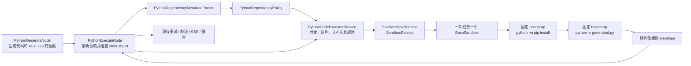
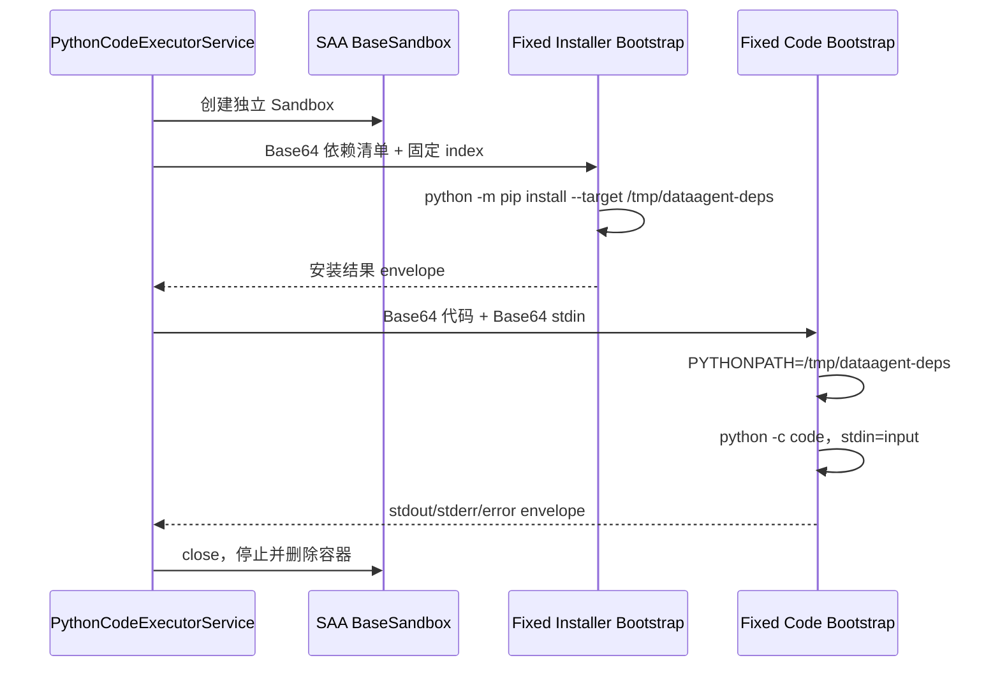

# SAA 1.1.2.2 Python 沙盒接入方案

> 状态：已通过 [PR #587](https://github.com/spring-ai-alibaba/DataAgent/pull/587) 合入上游。
> 本文同时记录当前实现边界、生产约束和已完成的验证，不再作为待实施设计稿使用。

## 1. 结论与范围

已完成的改造只覆盖 Python 生成与执行链路：

- Spring AI Alibaba 升级到 `1.1.2.2`
- Spring AI 对齐到 `1.1.2`
- Python 统一通过 `spring-ai-alibaba-sandbox` 执行
- 支持模型用 PEP 723 声明依赖，并在任务沙盒内动态安装
- 删除本地进程、自建 Docker 容器池和 AI Simulation 执行器
- SQL 生成、校验和执行链路不做改动

不存在本地执行或旧 Docker 执行器的回退。SAA 启动、依赖安装或代码执行失败时，结果进入
现有 Python 重试、降级或终止分支。

## 2. 改造后的链路



保持不变的业务协议：

1. 生成代码仍通过 `json.load(sys.stdin)` 读取 SQL 结果 JSON。
2. 业务结果仍从 stdout 返回，并由 `PythonExecuteNode` 做现有 JSON 解析。
3. Python 执行失败仍进入现有重试；达到上限后，普通执行失败进入降级分析，元数据解析或
   协议异常等分支可能直接终止。
4. StateGraph 节点关系和 SSE 事件协议不变。

### 2.1 包边界

`sandbox` 顶层只保留对外执行服务，内部按变化原因拆分：

```text
service/code/sandbox
├── SaaSandboxPythonCodeExecutorService.java
├── dependency
│   ├── PythonDependencyMetadata.java
│   ├── PythonDependencyMetadataParser.java
│   └── PythonDependencyPolicy.java
├── execution
│   ├── PythonSandboxBootstrapBuilder.java
│   ├── SandboxExecutionResult.java
│   └── SandboxExecutionResultParser.java
└── runtime
    ├── SaaSandboxRuntime.java
    └── SaaSandboxTaskRunner.java
```

- `dependency` 只负责 PEP 723 和依赖策略，不感知 SAA。
- `execution` 只负责固定 Python bootstrap 与结果协议，不管理容器。
- `runtime` 只负责 SAA 服务、任务 Sandbox 和 Runner 生命周期。
- 顶层服务只负责输入限制、并发队列和任务总超时。

## 3. 动态依赖协议

生成代码使用标准 PEP 723 `script` 元数据块：

```python
# /// script
# dependencies = ["pandas>=2,<3", "numpy>=1.24,<3"]
# ///

import json
import sys
import pandas as pd
```

处理规则：

1. 脚本最多包含一个 `# /// script` 块。
2. 后端使用 TOML Parser 读取 `dependencies` 和 `requires-python`。
3. 最多允许 20 个直接依赖，元数据最大 8 KiB。
4. 允许 PyPI 包名、extras 和版本约束。
5. 拒绝 URL、VCS、文件路径、`@`、环境标记和任何 pip 参数。
6. 模型不能提供 index、证书、命令、安装目录或 shell 片段。

`requires-python` 会被 TOML Parser 解析并保留在元数据对象中，但当前版本不会据此切换
基础镜像、选择解释器或校验 Sandbox 内的 Python 版本。需要固定 Python 版本时，应通过
`sandbox.image-name` 选择并锁定镜像。

依赖声明只是一组结构化包规格，不是命令字符串：

```text
TaskRequest
├── code
├── input
└── dependencies: List<String>
```

## 4. 受控动态安装

依赖和业务代码在同一个任务级 Sandbox 中分两阶段执行：



固定安装命令由后端生成：

```text
python -m pip install
  --disable-pip-version-check
  --no-input
  --no-cache-dir
  --target /tmp/dataagent-deps
  --index-url <服务端配置>
  <校验后的依赖清单>
```

关键边界：

- 不使用 shell。
- 代码、stdin、依赖和 index 均先 Base64 编码，避免字符串拼接注入。
- 安装目录只存在于本次容器，任务结束即删除。
- 安装超时和代码超时分开控制。
- 安装失败不会继续执行业务代码。
- 每次调用创建新 Sandbox，不跨 Agent、会话或重试复用可写状态。

## 5. SAA 框架接入

直接使用 1.1.2.2 提供的对象：

- `SandboxService`
- `ManagerConfig`
- `DockerClientStarter`
- `BaseSandbox`
- `SaaBasePythonRunner`
- `RunPythonToolRequest` / `RunPythonToolResponse`

`SaaSandboxRuntime` 懒启动单例 `SandboxService`，避免普通 Spring 单元测试要求 Docker
在线；应用关闭时统一调用 `cleanupAllSandboxes()` 和 `close()`。

每次任务创建新的 `BaseSandbox` 和新的 `SaaBasePythonRunner`。Runner 持有可变 Sandbox
引用，不能作为单例跨线程复用。

当前 SAA 1.1.2.2 的 Docker runtime config 可落地：

| 参数 | 默认值 |
|---|---:|
| 内存 | 500 MiB |
| CPU | 1 核 |
| nofile | 4096 |
| privileged | `false` |
| 代码超时 | 60 秒 |
| 依赖安装超时 | 3 分钟 |
| 最大并发 | 4 |
| 等待队列 | 10 |

`nofile` 不能沿用原方案的 256。官方基础镜像中的 supervisord 要求至少 1024；本方案使用
4096，并通过真实容器启动测试验证。

SAA 的 `SandboxConfig.timeout` 同时约束依赖安装和代码执行时的 HTTP 调用，不能只设置为
`code-timeout`。本方案按 `dependency-install-timeout + code-timeout + 30 秒通信余量`
计算 Sandbox 请求超时，避免 pandas 等较大依赖仍在安装时连接被提前关闭。

## 6. 输入输出协议

SAA Runner 只有 `code` 字段，没有独立 stdin 字段，因此使用固定 bootstrap 适配：

1. Java 校验代码和输入大小。
2. Java 对代码和 stdin 做 UTF-8 Base64。
3. Sandbox 内用固定 `subprocess.run([python, "-c", code])` 执行。
4. stdin 通过 subprocess 的 `input` 参数传入。
5. stdout、stderr、异常类型和错误信息封装为 JSON，再以固定 marker + Base64 返回。
6. Java 从 SAA 的原始响应中定位 marker 并反序列化。

结果协议：

```json
{
  "success": true,
  "stdout": "{\"result\":42}\n",
  "stderr": "",
  "errorType": null,
  "errorMessage": null
}
```

映射规则：

| Sandbox 结果 | 工作流结果 |
|---|---|
| `success=true` | `TaskResponse.success(stdout)` |
| Python 非零退出 | `TaskResponse.failure(stdout, stderr)` |
| 依赖安装失败 | `TaskResponse.failure(install stdout, install stderr)` |
| 响应协议错误、Docker 或通信异常 | `TaskResponse.exception(...)` |
| 外层任务超时 | 取消任务并返回 timeout exception |

## 7. 大小与并发限制

| 内容 | 默认上限 |
|---|---:|
| Python 源码 | 256 KiB |
| stdin JSON | 10 MiB |
| stdout | 1 MiB |
| stderr | 256 KiB |
| PEP 723 元数据 | 8 KiB |
| 直接依赖 | 20 |
| 并发 Sandbox | 4 |
| 等待队列 | 10 |

代码和 stdin 超限时不创建 Sandbox。stdout/stderr 在返回 envelope 前截断，Java 再校验
envelope 总大小。队列满时快速失败，不无限堆积请求。

完整工作流时间线会包含生成代码、安装日志和执行结果。WebFlux 请求缓冲上限设置为
`spring.codec.max-in-memory-size: 10MB`，保证浏览器保存这一时间线时不会因默认缓冲上限
触发 HTTP 413；Python stdout/stderr 仍受上表的独立沙盒限制。

## 8. 配置

```yaml
spring:
  ai:
    alibaba:
      data-agent:
        code-executor:
          python-max-tries-count: 5
          code-timeout: 60s
          limit-memory: 500
          cpu-core: 1
          sandbox:
            docker-host: ${DATAAGENT_SANDBOX_DOCKER_HOST:unix:///var/run/docker.sock}
            image-name: ${DATAAGENT_SANDBOX_IMAGE:agentscope-registry.ap-southeast-1.cr.aliyuncs.com/agentscope/runtime-sandbox-base:latest}
            container-prefix: dataagent-sandbox-
            max-concurrency: 4
            queue-capacity: 10
            max-code-bytes: 262144
            max-input-bytes: 10485760
            max-output-bytes: 1048576
            max-error-bytes: 262144
            max-metadata-bytes: 8192
            max-dependencies: 20
            max-connections: 4096
            package-index-url: ${DATAAGENT_PYPI_INDEX_URL:https://pypi.org/simple}
            dependency-install-timeout: 3m
```

开发环境可以使用公网 PyPI 完成端到端验证。生产环境必须通过环境变量切到企业私有 PyPI
代理和固定镜像 digest。

## 9. 删除项

以下实现不再保留：

- `CodePoolExecutorServiceFactory`
- `CodePoolExecutorEnum`
- `AbstractCodePoolExecutorService`
- `LocalCodePoolExecutorService`
- `DockerCodePoolExecutorService`
- `AiSimulationCodeExecutorService`
- 自建 docker-java client、image、host 和 pool 辅助类
- 对应单元测试和旧 Docker 集成测试

新的稳定边界为 `PythonCodeExecutorService`，当前只有
`SaaSandboxPythonCodeExecutorService` 一个实现。

## 10. 安全边界与生产加固

当前版本已经具备：

- 独立任务容器
- 非 privileged
- CPU、内存、nofile、超时、并发和输入输出限制
- 依赖声明策略
- 固定 pip 命令
- 任务完成后删除容器
- 不回退到宿主机执行

需要明确：动态安装要求 Sandbox 在安装阶段能访问包仓库，而 SAA 1.1.2.2 没有公开
“安装后立即断开容器网络”的 API。因此当前实现适用于本地和受控测试环境；生产上线还需
补齐基础设施级网络控制：

1. 仅允许访问私有 PyPI 代理，禁止访问其他公网和业务内网。
2. 固定基础镜像 digest，镜像内使用非 root 用户。
3. 不向 Sandbox 注入数据库、模型、OSS 或 Docker Socket 等业务凭据。
4. 私有代理增加恶意包、CVE 和许可证扫描。
5. 后续可增加 wheel-only、hash lock 和只读 wheel 缓存；这些是生产加固项，不作为
   当前代码已实现能力描述。

## 11. 验收结果

| 场景 | 验收条件 | 结果 |
|---|---|---|
| 动态依赖 | PEP 723 声明的包在任务 Sandbox 内安装成功 | 通过 |
| stdin | 生成代码能通过 `json.load(sys.stdin)` 读取 SQL 结果 | 通过 |
| stdout | JSON 结果保持现有工作流协议 | 通过 |
| Python 异常 | 进入现有重试、降级或终止分支 | 通过 |
| 超时/超限 | 返回明确失败并释放 Sandbox | 通过 |
| 隔离 | 两次执行不复用可写运行态 | 通过 |
| 清理 | 成功和失败后均无残留 `dataagent-sandbox-*` 容器 | 通过 |
| 端到端 | 浏览器发起真实分析后出现最终报告且 SSE 收到 `event:complete` | 通过 |

验证分层：

1. Parser、依赖策略、bootstrap、响应映射和执行器单元测试。
2. 真实 Docker 集成测试：SAA 创建容器、动态安装 `six==1.17.0`、读取 stdin、输出
   JSON、停止并删除容器。
3. 完整后端测试与格式检查。
4. 本地启动 Milvus、后端和前端，使用浏览器完成真实 StateGraph 请求。

### 11.1 自动化验证

- 完整 Maven 测试：1628 个测试，0 失败、0 错误、1 跳过。
- `spring-javaformat:validate` 和 Checkstyle 通过。
- 上游 PR 的 Frontend Build、linter、license、secret、format、check-style、
  test-and-build 等 8 项检查全部通过。

### 11.2 浏览器端到端验证

端到端验证使用真实模型和真实运行时，而非 mock：

1. 使用 Qwen Embedding 完成向量召回，使用 DeepSeek Chat 完成规划、代码生成和报告生成。
2. 第一次生成的 `pandas + six` 依赖在下载超时后，工作流携带错误进入代码重生成。
3. 重生成脚本仅声明 `six`，任务 Sandbox 动态安装 `six==1.17.0`，读取 SQL 结果 stdin
   并返回 JSON。
4. 浏览器时间线出现依赖安装、Python 执行和最终报告，SSE 收到 `event:complete`，结果成功
   持久化。
5. 成功和失败路径结束后均未残留 `dataagent-sandbox-*` 容器；验证完成后前后端已关闭。

这组证据同时覆盖了“依赖安装失败后重试”和“动态依赖安装成功后完成报告”两条关键链路。
单纯的后端 HTTP 200、单元测试或容器启动成功不能替代上述端到端验收。

### 11.3 CI 密钥边界

上游仓库可以把真实模型凭据放在 GitHub Actions Repository Secret 中，但从 fork 发起的
`pull_request` 工作流不会获得上游 Secret。因此：

- 常规 PR 的构建、格式、静态检查和无密钥测试必须保持可独立运行。
- 真实模型端到端测试应放在上游分支手动触发的工作流，或受保护 Environment 中执行。
- 不使用 `pull_request_target` 检出并执行 fork 代码来换取 Secret 访问，否则会把上游
  凭据暴露给不受信任代码。
- 日志、时间线和测试报告只记录模型/提供商名称，不输出 API Key。

## 12. 参考

- [快速开始](../../QUICK_START.md)
- [高级功能：Python 执行环境](../../ADVANCED_FEATURES.md#-python-执行环境配置)
- [开发者指南：代码执行器配置](../../DEVELOPER_GUIDE.md#5-代码执行器配置-code-executor)
- [系统架构：Python 沙盒链路](../../ARCHITECTURE.md#8-python-执行与结果回传)
- [Spring AI Alibaba v1.1.2.2 releases](https://github.com/alibaba/spring-ai-alibaba/releases)
- [Spring AI Alibaba Sandbox example](https://github.com/spring-ai-alibaba/examples/tree/main/spring-ai-alibaba-sandbox-example/sandbox-simple-tool)
- [PEP 723 – Inline script metadata](https://peps.python.org/pep-0723/)
